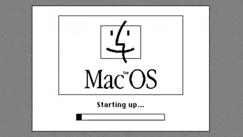

# Hello, World! 🌐
### You can call me Ludvig, and I would like to offer you a tour around my profile :D
## About me: 👨‍💻

🎓 - Computer Science undergraduate student at  Universidade Federal de Santa Catarina ([UFSC](https://ufsc.br/)).

⚙️ - Algorithms admirer and number theory enthusiast.

🔐 - Planning a future alongside cybersecurity.

### Languages: 💻

  
  
  
  

### Technologies and tools: 🛠️

  
  
  
  
  
  
  

### Currently studying: 📚
> 

## Contact me at: 📬

  
  
  

## Stats: 📊

 
    
    </td></tr></table>

<!-- 

  

 -->